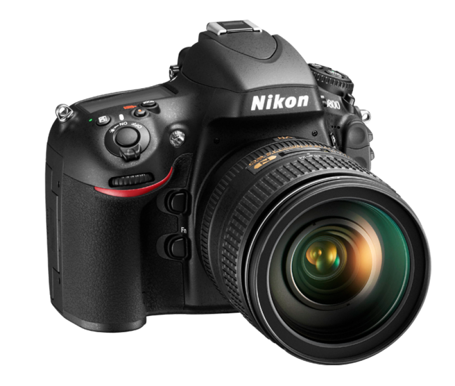

<!DOCTYPE html>
<html lang="en">
  <head>
    <meta charset="UTF-8" />
    <meta name="viewport" content="width=device-width, initial-scale=1.0" />
    <title>Document</title>
    
  </head>
  <body>
    <nav class="navbar">
      

        <a href="#about">About Us</a>
        

        <a href="#contact">Contact Us</a>
        

        <a href="#work">Work With Us</a>
      

      

        <a href="#track">Track Your Order</a>
        

        <a href="#partners">Our Partners</a>
        

        <a href="#faqs">FAQs</a>
      

    </nav>
    <section class="search-section">
      

        
        woodmart
      

      

        <input
          type="text"
          placeholder="🔍 Search products, brands, categories..."
        />
      

      <a href="#cart" class="cart" onclick="myfun()">🛒Cart</a>
    </section>
    <section class="category-account-section">
      

        <a href="#electronics">Electronics</a>
        <a href="#appliances">Appliances</a>
        <a href="#home-garden">Home & Garden</a>
        <a href="#baby-kids">Baby & Kids</a>
        <a href="#beauty-care">Beauty & Care</a>
      

      

        <a href="#login">Login</a>
        <a href="#signup">Sign Up</a>
        <a href="#watchlist">Watchlist</a>
      

    </section>
    

      

        

          
        

        

          
        

        

          
        

        <!-- Arrows -->
        <a class="prev" onclick="changeSlide(-1)">❮</a>
        <a class="next" onclick="changeSlide(1)">❯</a>
      

      
      

        

          <h2>Special Offer!</h2>
          
Save up to 30% on Washing Machines Limited Time Only!

          
$799 Special Offer

          
        

      

      

        

          
          Phones
        

        

          
          Laptops
        

        

          
          Furniture
        

        

          
          Watches
        

        

          
          Shoes
        

        

          
          Cameras
        

        

          
          Books
        

        

          
          Headphones
        

      

    

    

  

    

      
      
      
Fast, Free Shipping

    

    

      
      
Next Day Delivery

    

    

      
      
60 Days Free Return

    

    

      
      
Expert Customer Service

    

    

      
      
Exculsive Brands

    

  

    

  </body>
</html>
# Wood-Mart-Project
online wood mart for shopping
